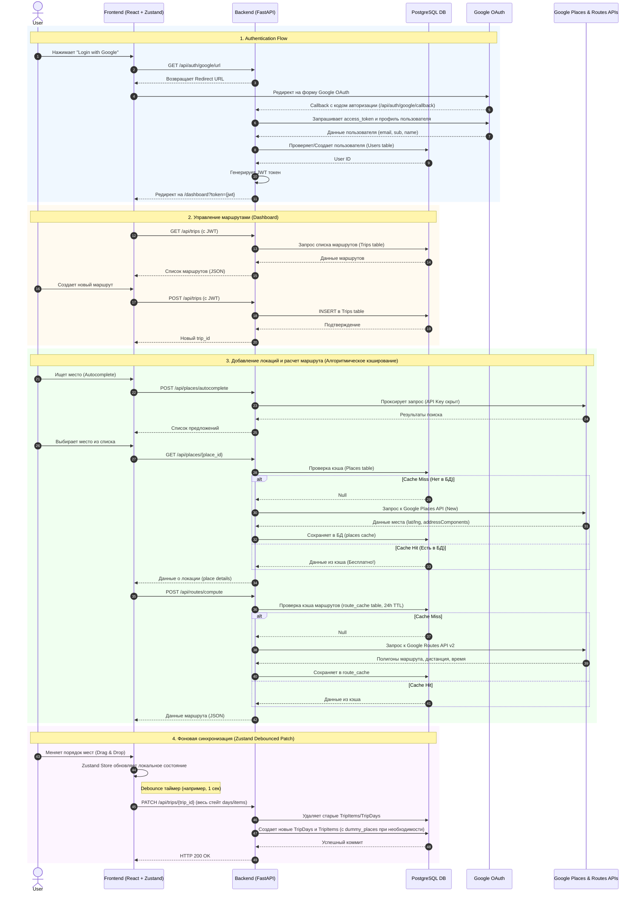

# Архитектура TripPlanner

В этом документе описаны ключевые взаимодействия компонентов системы и предложены варианты улучшения архитектуры.

## Sequence-диаграмма основных процессов

Ниже приведена диаграмма в формате Mermaid, описывающая взаимодействие Frontend (React/Zustand), Backend (FastAPI), Базы данных (PostgreSQL) и внешних API (Google OAuth, Google Maps).

## Идеи для улучшения (Архитектурные и логические рекомендации)

1. **Оптимизация PATCH-синхронизации (`/api/trips/{trip_id}`)**
   - **Сейчас:** При каждом изменении (например, drag & drop) фронтенд отправляет *весь* стейт маршрута (все дни и локации). Бэкенд жестко удаляет все дни и элементы (через `DELETE`) и пересоздает их заново (`INSERT`).
   - **Проблема:** Это неэффективно, создает лишнюю нагрузку на БД, быстро сжигает ID-шники (если используются инкрементальные) и может вызывать проблемы с параллельным редактированием (Race conditions).
   - **Улучшение:** Использовать более точечные API-эндпоинты (RESTful или JSON Patch), например `PUT /api/trips/{trip_id}/items/{item_id}` или передавать только массив изменений (Diff). Если оставить текущий подход, стоит использовать `UPSERT` (в Postgres `INSERT ... ON CONFLICT DO UPDATE`).

2. **Работа с Dummy Places при синхронизации**
   - **Сейчас:** Если фронтенд отправляет `place_id`, которого еще нет в таблице `places`, бэкенд создает `dummy_{place_id}` с нулевыми координатами, чтобы не нарушать Foreign Key ограничения (FK).
   - **Проблема:** Эти фиктивные записи засоряют БД. В базе появляются локации с координатами `0.0, 0.0` и именем "Synced Place". Если потом этот Place будет запрошен, бэкенд вернет пустышку вместо реальных данных из Google.
   - **Улучшение:** Либо фронтенд должен всегда сначала запрашивать `/api/places/{place_id}` (гарантируя наличие места в БД) перед PATCH-синхронизацией, либо бэкенд в момент получения неизвестного `place_id` во время PATCH должен асинхронно сделать запрос к Google Places API, чтобы сохранить корректные данные, а не пустышку.

3. **Обработка конкурентного редактирования (Race Conditions) и Offline-First**
   - **Сейчас:** Синхронизация просто перезаписывает состояние на сервере тем, что прислал клиент (Last write wins).
   - **Проблема:** Если пользователь откроет маршрут в двух вкладках или если вы решите добавить коллаборативный режим, изменения будут затирать друг друга.
   - **Улучшение:** Внедрить версионирование (например, `version` или `updated_at` поле). Если клиент отправляет стейт с `version=5`, а в базе уже `version=6`, бэкенд должен отклонить запрос (HTTP 409 Conflict), и фронтенд должен подтянуть свежие данные с сервера.

4. **Очистка устаревшего кэша (Route Cache TTL)**
   - **Сейчас:** Приложение проверяет кэш за последние 24 часа. Но старые записи (`timestamp > 24h`) остаются в таблице навсегда.
   - **Проблема:** Со временем таблица `route_cache` разрастется до гигантских размеров.
   - **Улучшение:** Написать фоновую задачу (Background worker на Celery, APScheduler, или банально CRON + SQL-скрипт), которая будет периодически делать `DELETE FROM route_cache WHERE timestamp < NOW() - INTERVAL '24 hours'`.

5. **Безопасность JWT Токенов**
   - **Сейчас:** JWT токены не имеют механизма инвалидации (например, при логауте). Если кто-то украдет токен, он будет действителен все 7 дней (`JWT_EXPIRE_MINUTES = 10080`).
   - **Улучшение:** Добавить черный список токенов (Token Blacklist) в БД или Redis для обработки явного логаута (`POST /api/auth/logout`). Или уменьшить время жизни Access Token до 15-30 минут, и внедрить Refresh Token (сохраняемый в HttpOnly Cookie).
